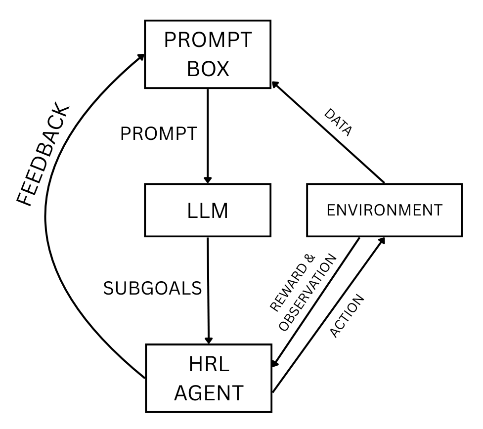

# LLM-guided HRL (HDQN) - FrozenLake (Gymnasium)

Reference implementation for my bachelor thesis **“Language Models as Subgoal Generators for Hierarchical Reinforcement Learning”**.

This repo demonstrates a closed feedback loop where:
1) an **LLM proposes subgoals** (tile indices),
2) an **HDQN agent** trains to reach them,
3) the trained agent is **evaluated** (statistics + average reward),
4) the evaluation feedback is inserted into the next prompt.

The core idea is to replace manually engineered subgoals with LLM-generated subgoals.



---

## What’s implemented here

### Environment
- **Gymnasium FrozenLake-v1**, map size **8×8**
- Deterministic setting (`is_slippery=False`)
- Rewards:
    - +1 on reaching goal
    - -1 on falling into hole
    - 0 otherwise

Subgoals are integers **0-63** (flattened grid index).

### Agents / Variants
This code supports two HRL variants using the same HDQN implementation:
- **Set of Subgoals**: meta-controller (DQN) learns which subgoal to pick
- **Fixed Order Subgoals**: meta-controller is a simple list that steps through subgoals (no meta DQN learning)

Baselines:
- **DQN** (primitive actions) exists as a network module (training baseline not included as a separate script in this repo version).

---

## Quickstart

### 1) Install dependencies
```bash
pip install -r requirements.txt
```

### 2) (Optional) Use a real LLM
Create a `.env` file in the project root:
```bash
OPENAI_API_KEY=YOUR_KEY_HERE
```

Then switch in `src/main.py`:
```bash
llm = ChatGPTLLM()  # instead of MockLLM()
```

### 3) Run the experiment
Run from the repository root:
```bash
python -m src.main
```

Outputs:
- Trained models: models/hdqn_meta.pt and models/hdqn_ctrl.pt
- Training plot: plots/training_rewards.png
- Optional evaluation rendering window (if enabled)

---

## Where to change important settings

Open `src/main.py`:

Training episodes:
```bash
episodes = 10_000
```

Evaluation episodes (for feedback stats):
```bash
eval_episodes = 100
```

LLM refinement iterations:
```bash
llm_iterations = 2
```

Number of independent training runs:
```bash
training_runs = 10
```

Note:
Each iteration means prompt -> subgoals -> train -> evaluate -> feedback -> next prompt.

---

## Code tour (what to read first)

Main runner
- src/main.py
  - Training loop (train())
  - Evaluation loop (evaluate())
  - Experiment loop (run_experiment())

HDQN (core HRL logic)
- src/agents/hdqn.py
  - Wires together meta-controller and controller
  - Manages replay buffers and target network syncing

Controllers
- src/agents/controllers/meta_controller.py
  - DQN selecting subgoals (set-of-subgoals variant)
- src/agents/controllers/fixed_meta_controller.py
  - Sequential subgoal list (fixed-order variant)
- src/agents/controllers/controller.py
  - DQN controller selecting primitive actions for a chosen subgoal

LLM interface and prompt
- src/llm/llm.py
  - MockLLM and ChatGPTLLM
- src/llm/prompt_box.py
  - Prompt construction
  - Parsing LLM output
  - Adding feedback

Environment wrapper and encoding
- src/env/frozen_lake_env.py
  - Gymnasium environment creation
  - Map definition
- src/env/state_encoder.py
  - One-hot encoding for meta and controller inputs

Visualization and plots
- src/utils/visualizer.py
  - Overlays current subgoal cell (red) and action badge
- src/utils/plotter.py
  - Moving-average reward curves

---

## License
This project is released into the public domain under the Unlicense.

If you use this repository for academic work, citing the thesis is appreciated but not required.
